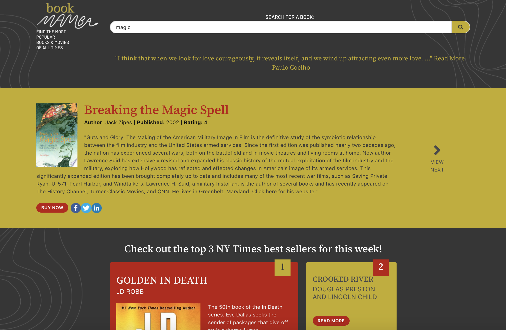

# PROJECT 1: Book search API

***Authors: Omar Minaya, Keyla Santoyo, Marcos Marti & Enid Soto***

## User Story

As a book lover, I want to find the most popular books in a given topic, so I can read only the best books.

## Purpose of the Application

We developed a simple application where a user can search for books and receive information on the highest-rated results we could find. The site also adds value to the user by displaying inspirational quotes and the top three books on the New York Times best sellers list.

The main purpose of the project is to apply all the knowledge we acquired in the first part of the UM Full Stack Developer Bootcamp 2019-2020.

## Concept

The name of the application is "Book Mamba." We chose the name of a snake because in some cultures, this animal is a symbol of wisdom. The UI is modern, strong, and sleek.

## Technologies used

The application's interface was built with the *Bulma* framework and custom css styles. The functionality was implemented with jQuery and custom javascript.

## APIs used

- "They Said So" quotes API
- Google Books API
- New York Times best sellers API

## Functionality

On loading, the page displays a random inspirational quote and the top three books from the New York Times best sellers list. At the top of the page, the user has a search bar where they can type in a keyword, title or ISBN. The user can click the search icon or press the "Enter" key. The application takes the user's input and performs a request to the Google Books API. Then the responses from the API are sorted to include only the top rated books. The user can click the "View Next" button to get another high rated result.

## User interface

## Link to the deployed application

You can find the deployed application [here](https://omiinaya.github.io/Project1/)

